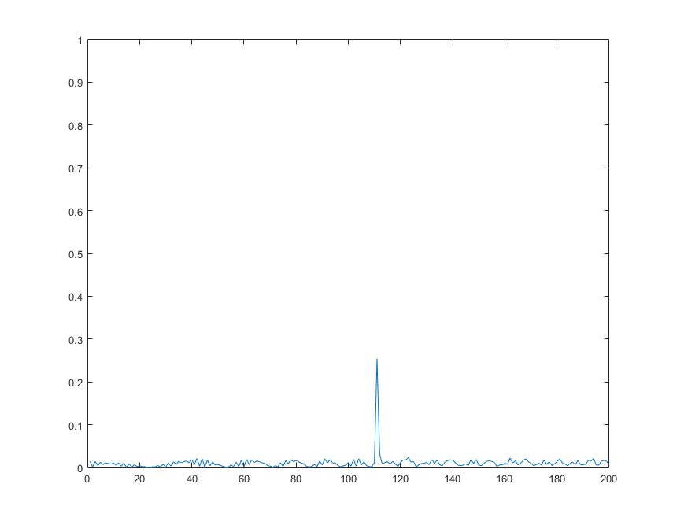
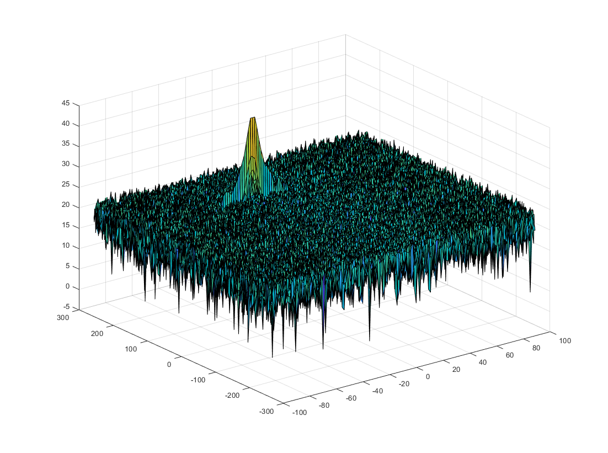
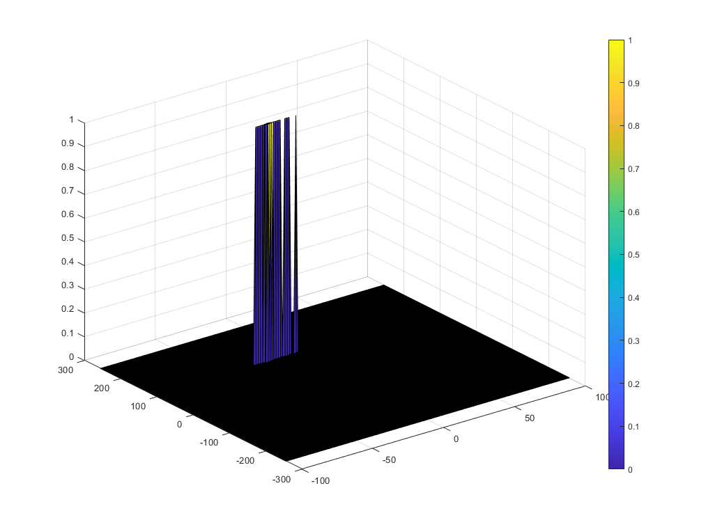

# Radar Target Generation and Detection

## Project Overview

This project aims to determine range and velocity of an target object from given radar signal. 

This includes:

- Configure the FMCW waveform based on the system requirements.
- Define the range and velocity of target and simulate its displacement.
- For the same simulation loop process the transmit and receive signal to determine the beat signal
- Perform Range FFT on the received signal to determine the Range
- Towards the end, perform the CFAR processing on the output of 2nd FFT to display the target.


## Radar System Requirements

- In this project, I designed a Radar based on the given system requirements (above).


## Writeup

### FP01. FMCW Waveform Design

I could determine the parameters (B, Tchirp, slope) for designing a FMCW waveform by below equations
$$
B_{sweep} = c / 2 * res\\
T_{chirp} = 5.5 * 2 * R_{max} / c\\
Slope = B / T_{chirp}
$$
The result of slope is `2.0455e+13` which meets the specifications.

### FP02. Simulation Loop

I modeled the transmitted signal and received signal with  below equations:
$$
Tx(t) = cos(2\pi(f_c t + \frac{\alpha * t ^2}{2})) \\
Rx(t) = cos(2\pi(f_c (t-\tau) + \frac{\alpha * (t-\tau) ^2}{2}))
$$
The time delay $$\tau$$ is the travel time of transmitted signal therefore I modeled $$\tau$$ as below equations:
$$
\tau = 2 * R(t)/c \\
R(t) = R_{init} + V_{init} \times t;
$$

### FP03. Range FFT (1st FFT)

I implemented 1D FFT for the given radar measurement with below MATLAB code.

```MATLAB
%% RANGE MEASUREMENT
Mix_1d = reshape(Mix, [Nr, Nd]);  % reshape the vector into Nr*Nd array. 
                                  % Nr and Nd defines the size of
                                  % Range and Doppler FFT respectively.
Mix_fft = fft(Mix_1d,Nr)/Nr; % run the FFT on the beat signal 
                             % along the range bins dimension (Nr) and
                             % normalize.
Mix_fft = abs(Mix_fft);      % Take the absolute value of FFT output
Mix_fft = Mix_fft(1:Nr/2); % throw out the half since it is double sided.
						   % it will also leave the first FFT result only.
```

I set the initial position of a target object to 110m and the velocity to -20m/s in this project and I can observe the target object in the below FFT results.

| 1D FFT                       | 2D FFT                       |
| ---------------------------- | ---------------------------- |
|  |  |

### FP04. 2D CFAR

| CRITERIA                                                     | MEETS SPECIFICATIONS                                         |
| :----------------------------------------------------------- | :----------------------------------------------------------- |
| Implement the 2D CFAR process on the output of 2D FFT operation, i.e the Range Doppler Map. | The 2D CFAR processing should be able to suppress the noise and separate the target signal. The output should match the image shared in walkthrough. |
| Create a CFAR README File                                    | In a README file, write brief explanations for the following:Implementation steps for the 2D CFAR process.Selection of Training, Guard cells and offset.Steps taken to suppress the non-thresholded cells at the edges. |

I implemented 2D CFAR with `conv2` which is 2D convolution function of MATLAB.

```
```


